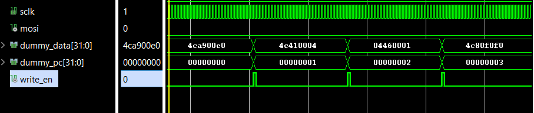
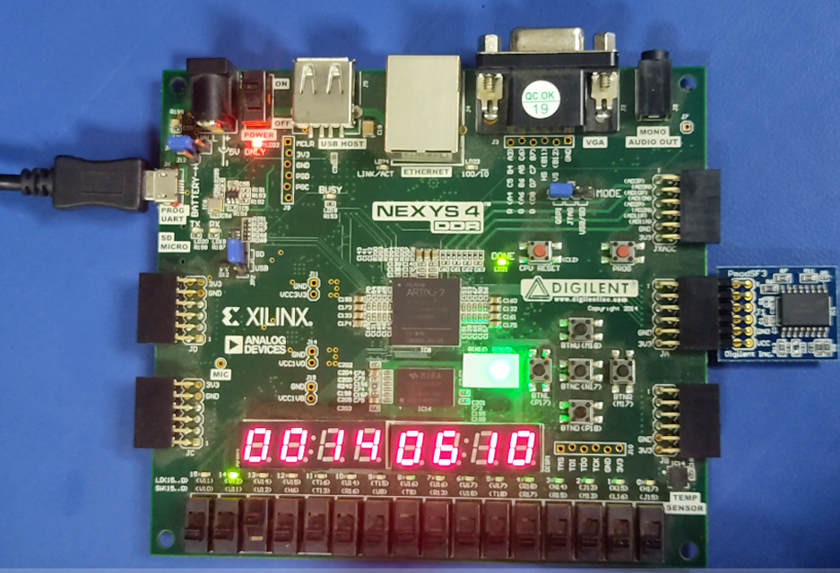

# SoC SPI Flash Boot Interface

## Project Overview
This project implements a hardware-based **SPI Flash Boot Interface** designed to autonomously load program binaries from an external Serial Flash memory into on-chip SRAM upon system reset .This architecture eliminates the need for an internal Boot ROM, relying instead on a dedicated Finite State Machine (FSM) to handle SPI protocol sequences (Command, Address, Data) directly 

## Hardware Specifications
***FPGA Board:** Digilent Nexys 4 DDR (Xilinx Artix-7 XC7A100T)
***External Memory:** Micron N25Q256A Serial NOR Flash (32MB) .

## File Structure
| File Name | Description |
| :--- | :--- |
| **`SPI_Flashcontroller.v`** | Main design module implementing the SPI Master FSM for reading instructions. |
| **`tb_flash.sv`** | SystemVerilog testbench verifying read/write logic by emulating flash behavior. |
| **`Bulk_Erase.v`** |Utility module to wipe the N25Q256A chip before programming . |
| **`LED_Driver.v`** |Driver for 7-segment displays to verify loaded data on hardware . |

## Verification Methodology
1. **Programming:** A binary file corresponding to a **Fibonacci Series generation program** was written to the Flash memory .
2.  **Hardware Verification:** Upon reset, the design autonomously transferred the binary to instruction memory.Success was verified by observing the calculated Fibonacci numbers on the Nexys 4 DDR 7-segment displays .

## Results

### Simulation
Waveform verifying the SPI Read command (`0x03`), address transmission, and data capture.

### FPGA Implementation
The design was successfully validated on hardware with the following performance metrics.

#### Timing Report (Clock: 100 MHz)
| Parameter | Value |
| :--- | :--- |
| **Running Frequency** |100 MHz  |
| **Worst Negative Slack (WNS)** |1.774 ns  |
| **Worst Hold Slack (WHS)** |0.066 ns  |
| **Total Endpoints** |202  |

#### Power Consumption
| Parameter | Value |
| :--- | :--- |
| **Total On-Chip Power** |0.1 W  |
| **Dynamic Power** |0.016 W  |
| **Device Static Power** |0.085 W  |
| **Junction Temp** |25.2°C  |

## References
***Micron Serial NOR Flash Memory Data Sheet (N25Q256A)**].
***Digilent Nexys 4 DDR Reference Manual**.
